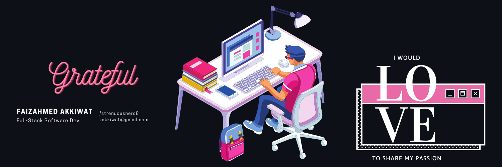

<h1 align="center">Hola! </h1>
<h3 align="center">Creativity is intelligence having fun.</h3>
<h5 align="center"> Web, Software, Problem Solving, Graphic Design, Illustration, Freelancing</h5>

## 🙋‍♂️ About Me

- 🔭 I’m currently aiming to be **Competitive Coder**

- 🌱 I’m currently learning **Data Structures and Algorithms.**

- 👨‍💻 Visit my website **[My Presentation](https://illusiveadroits.netlify.app/)**

- 📫 How to reach me **zakkiwat@gmail.com**

- ⚡ Fun fact **I like esports and mastering multiple things at once.**

## 🚀 Languages and Tools:

    
    
    
    
    
    
    
    

<!--       -->
 

    

## 📊 My Github Stats

   
    
  
   
  <b>Note:</b> Top languages is only a metric of the languages my public code consists of and doesn't reflect experience or skill level.

 
 

 
 

## Connect with me:

## ❤ Views and Followers

